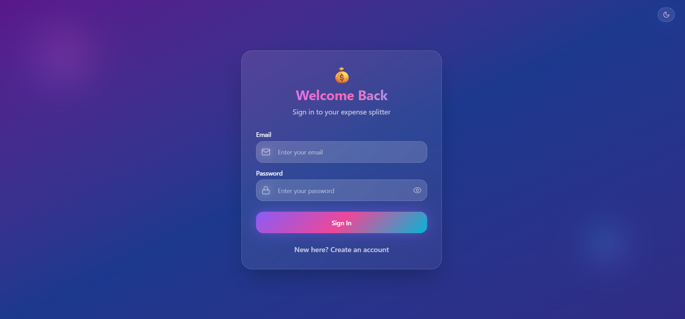
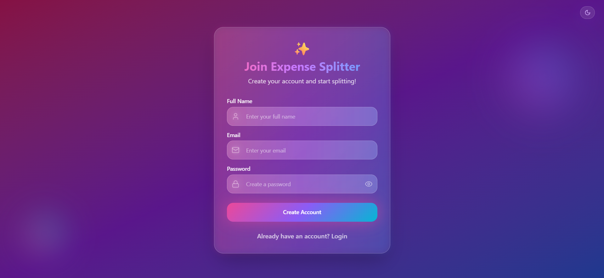
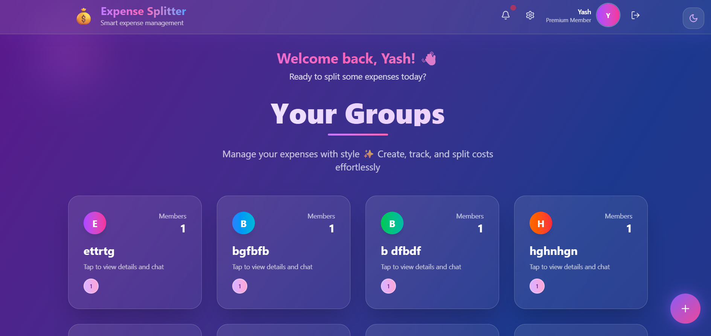
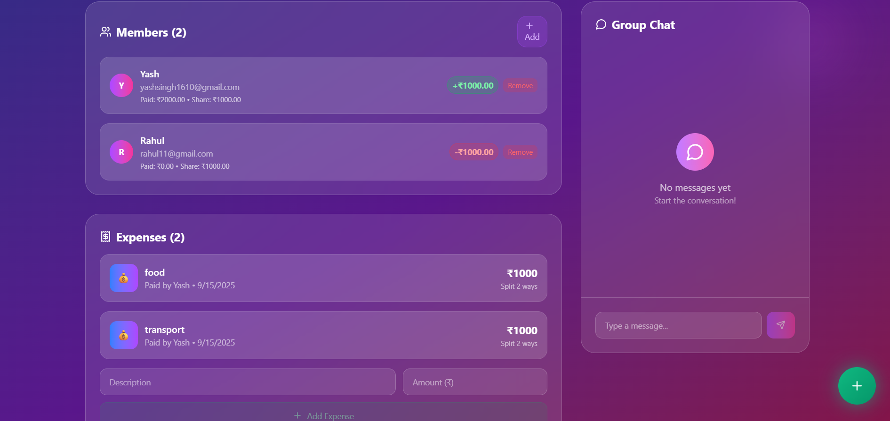
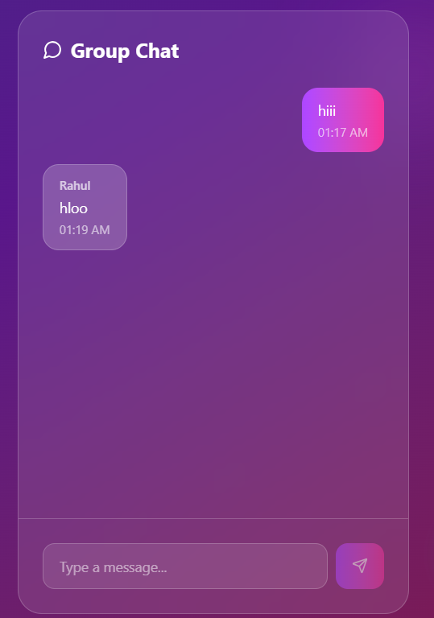

# 💸 Expense Splitter App  

A *premium, futuristic, and realtime Expense Splitter* built with *React, TailwindCSS, Node.js, Express, MongoDB, and Socket.io*.  
Split expenses with friends, track balances, chat inside groups, and get realtime notifications – all in one place.  

🌐 *Live Demo*: [Expense Splitter App](https://expense-splitter-app-ys.vercel.app)  

---

## ✨ Features  

- 👥 *Group Management*  
  - Create groups with friends/colleagues  
  - Invite/remove members  
  - Manage member balances  

- 💰 *Expense Tracking*  
  - Add shared expenses (auto-split)  
  - Track who owes / who gets back  
  - Realtime balance updates  

- 💬 *Realtime Chat*  
  - Group chat with Socket.io  
  - Typing + instant message delivery  

- 🔔 *Notifications*  
  - Expense added  
  - New member invited  
  - Member removed  

- 🎨 *Premium UI (Figma → React + Tailwind)*  
  - Futuristic glowing gradients  
  - 3D glassmorphism effects  
  - Theme toggle (Light/Dark)  
  - Mobile + Desktop responsive  

---

## 🖼 Screenshots  

### 🔐 Authentication  
  
  

### 🏠 Dashboard  
  

### 👥 Group Details  
  

### 💬 Realtime Chat  
  

---

## 🛠 Tech Stack  

*Frontend*:  
- React  
- TailwindCSS  
- Axios  
- React Router  
- React Toastify  
- Socket.io-client  

*Backend*:  
- Node.js + Express  
- MongoDB Atlas  
- JWT Authentication  
- Socket.io  

*Deployment*:  
- Frontend → Vercel  
- Backend → Render  

---

## 🚀 Getting Started  

### Clone the repo  
```bash
git clone https://github.com/coder40425/Expense-Splitter-App.git
cd Expense-Splitter-App

#Backend#
cd server
npm install
# Add .env with:
# MONGO_URI=your_mongo_atlas_uri
# JWT_SECRET=your_secret_key
npm run dev

#Frontend#
cd client
npm install
npm start

---       ```

##License

This project is licensed under the MIT License — see the LICENSE file for details

